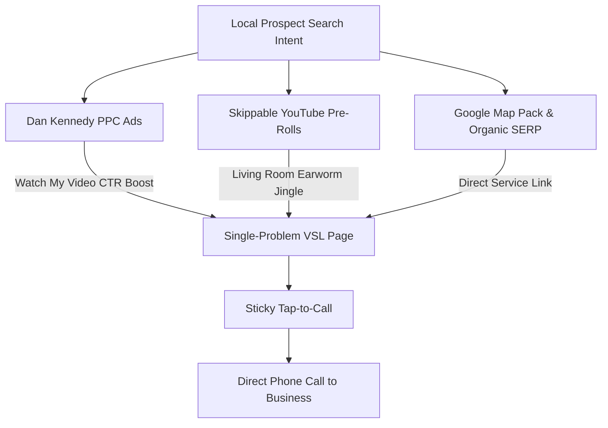
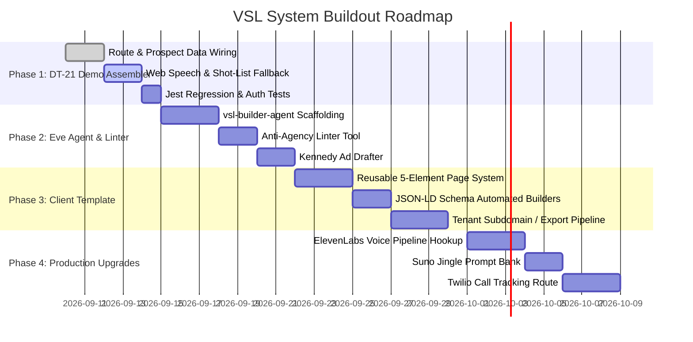

# Single-Problem Video Sales Landing Page (VSL) — Architecture, Tooling, and Implementation Plan

> **Canonical Sales & Architectural Doctrine:** [Lessons of Local Internet Presence](file:///home/knowself/dev/dg-web/doc/lessons-of-localinternetpresence.md) &bull; [The Mission](file:///home/knowself/dev/dg-web/doc/The-Mission.md) &bull; [Book Ch. 5](file:///home/knowself/dev/dg-web/src/app/book/page.tsx#L258)  
> **Commercial Wedge:** Option A — $1,500 VSL Sprint &bull; Core Engine of the $300–$500/mo Retainer  
> **Author / Architect:** Derivative Genius Engineering &bull; Centurion Operating Fleet

---

## 1. Executive Summary & Definition

### 1.1 What is a Single-Problem VSL?
A **Single-Problem Video Sales Landing Page (VSL)** is a high-converting, 1-page direct-response web page engineered to address **exactly one urgent commercial problem** for a local business, present **one 45–60 second founder explainer video**, and provide **one primary action: tap to call**.

It replaces bloated, multi-page corporate brochure sites with a focused conversion funnel designed around a single psychological imperative: **make the phone ring**.

```
┌────────────────────────────────────────────────────────────────────────┐
│               THE SINGLE-PROBLEM VSL CONVERSION ENGINE                 │
├────────────────────────────────────────────────────────────────────────┤
│  1. Search Intent: "Emergency AC Repair Clearlake"                      │
│     ▼                                                                  │
│  2. Ad / Map Pack: Problem → Agitate → "Watch My Video"                │
│     ▼                                                                  │
│  3. 1-Page VSL:                                                        │
│     • Risk-Reversal Headline: "Ice cold today guaranteed or it's free" │
│     • 45–60s Explainer Video + 15s SERP Earworm Jingle                 │
│     • Proof Strip: Google 5-Star Reviews & Local Trust Badges          │
│     • Direct Agitation Copy + Semantic FAQ Schema                      │
│     • Sticky Mobile Tap-to-Call Button in Bottom Thumb Zone            │
│     ▼                                                                  │
│  4. Result: Phone Call Initiated within 30–60 Seconds                  │
└────────────────────────────────────────────────────────────────────────┘
```

### 1.2 The Origin Story & Proven Pedigree
Over 20 years ago, alongside copywriter Jim Edwards and direct-response titan Dan Kennedy, **Mike Stewart co-invented the Video Sales Letter (VSL)** when Flash video first arrived on the web. They proved that a plain human being on camera, backed by authentic direct-response psychology, dramatically outperforms multi-million-dollar corporate agency websites.

### 1.3 The Core Cognitive Law
> *"People will watch before they read."*

A customer dealing with a flooded basement, broken HVAC unit, or termite swarm is in a state of high anxiety. They will not read a 1,500-word corporate "About Us" page. When they see a real human owner explaining the solution in 45 seconds on video, trust is established instantaneously.

### 1.4 The Contrarian Critique: The Agency Trap
Traditional web agencies build websites designed to win design awards rather than ring the business's phone:
- **The Award-Winning Penalty:** Awards are often a *negative indicator* of commercial conversion.
- **Hero Slider Bloat:** Giant photo carousels, parallax scrolls, and stock video push the core value proposition and contact information far below the fold.
- **Vague Corporate Slogans:** Taglines like *"Excellence in Every Pipe"* or *"Integrity First"* fail to confirm whether the contractor solves the customer's specific problem.
- **The Hamburger Menu Folly:** Hiding contact numbers inside complex multi-tiered menus on mobile devices alienates older and emergency-driven demographics.
- **The 90% Bounce Reality:** Visitors arriving from emergency search queries bounce within 10 seconds if they cannot immediately find reassurance and a phone number.

---

## 2. Anatomy of the 5-Element VSL Page

Every single-problem VSL built by Derivative Genius strictly implements the **5-Part Page Architecture** codified in Book Chapter 5:

```
┌────────────────────────────────────────────────────────────────────────┐
│ 1. Direct-Response Headline (Dan Kennedy Risk Reversal)                │
│    "We will make your house ice cold today guaranteed or it's free."   │
├────────────────────────────────────────────────────────────────────────┤
│ 2. Explainer Video Slot (45–60s) + 15s SERP Earworm Jingle             │
│    [ Founder on Camera / LazyYouTube / Unlisted Stream Embed ]         │
├────────────────────────────────────────────────────────────────────────┤
│ 3. Social Proof Container                                              │
│    ★★★★★ 4.9 Stars (184 Verified Google Reviews) + Trust Badges       │
├────────────────────────────────────────────────────────────────────────┤
│ 4. Plain-Spoken Sales Copy & Agitation + FAQ Schema                    │
│    • Agitate the hidden danger/cost of delay                           │
│    • 3–4 bullet points detailing the exact fix                         │
│    • Local FAQ accordion backed by JSON-LD FAQPage markup              │
├────────────────────────────────────────────────────────────────────────┤
│ 5. Persistent Mobile Sticky "Tap-to-Call" Button                       │
│    [ 📞 Call (310) 379-9822 — Available 24/7 ] (Anchored in Thumb Zone)│
└────────────────────────────────────────────────────────────────────────┘
```

### Component 1: Risk-Reversal Headline
- **Formula:** *"We will give you the most thorough, amazing, unbelievable [Service] service guaranteed or it's free."*
- **HVAC:** *"We will make your house ice cold today guaranteed or it's free."*
- **Plumbing:** *"We will fix your leaky toilet today guaranteed or it's free."*
- **Roofing:** *"Your roof will not leak after our repair, guaranteed or it's free."*
- **Psychology:** Flips the perceived risk from the homeowner onto the service provider. In 15 years of testing across hundreds of contractors, virtually nobody asks for a refund; customers simply want the psychological safety that warrants making the call.

### Component 2: 45–60 Second Explainer Video + Jingle Slot
- Shot on a modern smartphone or webcam by the actual owner or technician.
- **Script Structure (60 Seconds):**
  1. *Hook (0–10s):* Confirm the exact symptom (*"If water is pooling near your water heater..."*).
  2. *Agitation (10–25s):* Explain what happens if ignored (*"A corroded tank can burst and flood your foundation within 48 hours..."*).
  3. *Solution & Guarantee (25–45s):* Detail the fix and the risk-reversal guarantee (*"Our licensed technicians arrive in fully-stocked vans. Fixed today guaranteed or it's free."*).
  4. *Call to Action (45–60s):* Direct instruction (*"Tap the green button below right now to get an immediate dispatcher on the line."*).
- **Earworm Intro/Outro:** 15-second AI jingle created via Suno with the exact SERP term front-loaded in seconds 0–5.

### Component 3: Social Proof Strip
- Positioned immediately beneath the video player before any body text.
- Displays verified Google Business Profile ratings (e.g. `4.9 ★★★★★ 182 Reviews`).
- Includes verified local badges (Licensed, Insured, Chamber Member, BBB, EPA Certified).

### Component 4: Plain-Spoken Body Copy & Semantic FAQ Schema
- Answers the 3–5 most critical customer questions:
  - *"How fast can you get here?"*
  - *"How much will it cost to inspect?"*
  - *"Are your technicians background-checked and licensed?"*
- Embedded with rich `FAQPage`, `LocalBusiness`, `Service`, and `VideoObject` structured JSON-LD data for Generative Engine Optimization (GEO) in Google Gemini, Claude, and ChatGPT search.

### Component 5: Persistent Mobile Sticky "Tap-to-Call" Action Bar
- Permanent fixture anchored to the bottom viewport (thumb zone) on mobile viewports (< 768px).
- Minimum 48px touch target with tactile haptic confirmation.
- Contains direct `tel:` link and emergency operating hours.

---

## 3. The Surrounding Traffic & Arbitrage Engine

A single-problem VSL does not stand alone; it is the conversion terminal for a three-pronged acquisition strategy:



### 3.1 Dan Kennedy's "Watch My Video" PPC Ad Formula
When running Google Search Ads, never link to a general homepage. Match the exact problem query to the single-problem VSL using Kennedy's agitation copy:
> *"Tired of termites? Scared they're eating your foundation? Want them gone today? Watch my video."*

Adding the explicit directive **"Watch my video"** in Google Ad headlines quadruples click-through rate (CTR) by promising visual clarity over tedious reading.

### 3.2 Hyper-Local YouTube Skippable Pre-Roll Arbitrage
- **The Economic Hack:** Google charges **$0.00** when a YouTube viewer skips a pre-roll ad before 30 seconds.
- **The Jingle Strategy:** By front-loading the business name and exact SERP term into the first 5 seconds of the video, millions of local residents hear the audio earworm completely free (e.g. West Texas Pest Patrol: 8M skips = massive auditory brand saturation across living-room TVs for near-zero cost).
- **Targeting Constraint:** Tight 15–20 mile radius around the shop. No restrictive demographic over-filtering; let Google's machine learning find in-market buyers.

---

## 4. Current Repository Audit: What We Have vs. What We Need

### 4.1 What Exists Today in `dg-web`
| Area | Existing Asset / Capability | Status |
|---|---|---|
| **Doctrine & Framework** | `doc/lessons-of-localinternetpresence.md`, `doc/The-Mission.md`, `src/app/book/page.tsx` | Complete |
| **Audit Diagnostics** | `/centurion/audit-tools` (identifies missing VSL, missing sticky call, hero sliders) | Live in Centurion |
| **Mobile Thumb-Zone Bar** | `src/components/MobileBottomBar.tsx` (sticky tap-to-call, mail, sheet intake) | Implemented & Polished |
| **Video Playback** | `src/components/LazyYouTube.tsx` (high-performance facade player with zero initial JS bloat) | Production-ready |
| **Database & Pipeline** | Drizzle ORM + Neon PostgreSQL schema for prospects, audits, call logs, newsletters | Live |
| **Centurion Backoffice** | `/centurion/prospects`, `/centurion/pipeline`, `/centurion/reports`, `/centurion/newsletter` | Operational |

### 4.2 What is Missing (The Gap to Full Fulfillment)
1. **No Live VSL Generator or Assembler:** While `/centurion` audits whether a client lacks a VSL, operators cannot yet click a button to assemble a live demo VSL page for a prospect (DT-21).
2. **No Anti-Agency Page Linter:** We lack an automated code/spec linter to verify that client landing pages comply with our strict no-slider, sticky-call rules.
3. **No Automated Script & Headline Drafter:** Operators must manually write 60s video outlines and risk-reversal headlines instead of having agent assistance.
4. **No Multi-Tenant Client Landing Page Template System:** We do not currently have a unified Next.js route or export system to spin up client subdomains or static VSL bundles.
5. **No AI Audio/Jingle Synthesis Pipeline:** No automated integration for Suno jingles or ElevenLabs voice cloning.

---

## 5. Tools & Systems We Need to Build or Install

To deliver Single-Problem VSL pages for clients at scale ($1,500 sprints and $300–$500 retainers), we need a clear separation between **internal agentic tools to build** and **external services to install/integrate**:

```
┌────────────────────────────────────────────────────────────────────────┐
│                        VSL TOOLING ARCHITECTURE                        │
├──────────────────────────────────┬─────────────────────────────────────┤
│ 1. INTERNAL TOOLS TO BUILD       │ 2. EXTERNAL SERVICES & LIBRARIES    │
│ • DT-21 VSL Demo Assembler       │ • ElevenLabs API (Voice Clone)      │
│ • vsl-builder-agent (Eve)        │ • Suno / Udio (15s Earworm Jingles) │
│ • Anti-Agency Linter Tool        │ • LazyYouTube / Cloudflare Stream   │
│ • Semantic JSON-LD Generator     │ • Twilio / CallRail (Call Tracking) │
│ • 5-Part Client Page Template    │ • Google Ads API / Google Search    │
└──────────────────────────────────┴─────────────────────────────────────┘
```

### 5.1 Internal Tools to Build in the Repository

#### 1. DT-21: VSL Demo Assembler (Slice 1: Zero Keys, Zero Dependencies)
- **Location:** `src/app/centurion/demos/[id]/page.tsx`
- **Function:** Reads prospect data (`businessName`, `serpTerm`, `websiteObservation`, `reviewCount`, `phone`) and dynamically renders a live, private 5-part demo page:
  - Generates localized risk-reversal headline.
  - Generates 60-second Problem → Agitate → Solve script draft.
  - Video slot renders `LazyYouTube` if URL exists; otherwise displays an interactive **"60-Second Video Shot-List Card"** explaining what the owner should film.
  - Voiceover preview uses the browser's native **Web Speech API** (`window.speechSynthesis`) — requires **no API keys, no subscriptions, and zero cost**.
  - Lyric-card jingle slot showing 15-second timing marks.
  - Watermarked with `PRIVATE DEMO` for live screen-sharing during 20-minute audit walkthroughs.

#### 2. `vsl-builder-agent` (Eve Agent Fleet)
- **Location:** `agents/vsl-builder-agent/` (following `agents/audit-agent/` structure).
- **Capabilities & Sub-Tools:**
  - `draft_vsl_headline.ts`: Generates 3 risk-reversal headline variants based on industry and target money job.
  - `outline_explainer_video.ts`: Produces 45–60 second shot-by-shot script with visual and vocal pacing cues.
  - `lint_vsl_page.ts`: Automated anti-agency validator. Enforces:
    - ❌ Fails if photo sliders or carousel banners are detected.
    - ❌ Fails if phone number is not sticky on mobile viewports.
    - ❌ Fails if corporate slogans (*"Quality you can trust"*) exist without risk-reversal guarantee.
    - ❌ Fails if primary CTA is buried beneath multi-step forms.
    - ✅ Passes when 5 elements are in strict top-to-bottom sequence.
  - `draft_kennedy_ad.ts`: Formats Google Ads and Facebook/YouTube copy with "Watch my video" hooks.

#### 3. Client Landing Page Template Engine
- **Location:** `src/templates/vsl/` or dynamic tenant routing `src/app/sites/[clientSlug]/page.tsx`
- **Structure:** Modular React components for each of the 5 VSL elements:
  - `<VslHeadline />`
  - `<VslVideoPlayer />` (LazyYouTube or self-hosted MP4)
  - `<VslProofStrip />` (dynamic review counter and badge grid)
  - `<VslCopyFaq />` (with automated JSON-LD injection)
  - `<VslStickyCallBar />` (reusing ergonomics from `MobileBottomBar.tsx`)

---

### 5.2 External Tools & Libraries to Install or Configure

#### 1. Audio & Voice Production
| Tool | Purpose | Integration Level |
|---|---|---|
| **Web Speech API (Browser Native)** | Zero-cost, instantaneous client-side voiceover preview for prospect demos | Built-in browser feature (no install needed) |
| **ElevenLabs API** | Clones 60-second owner voice sample to narrate weekly blog transcripts and video voiceovers (+ instant Spanish dubbing) | REST API / `@elevenlabs/client` |
| **Suno / Udio** | AI music generation engine to produce 15-second genre-matched SERP term jingles | Manual prompt engineering or API dispatch |

#### 2. Video Capture & Hosting
| Tool | Purpose | Integration Level |
|---|---|---|
| **Loom / Riverside.fm** | Fast remote recording of owner's 60-second video during onboarding | Web links / client self-recording guidelines |
| **YouTube (Unlisted)** | Zero-cost, high-speed CDN video streaming via existing `LazyYouTube.tsx` | Embed URL (default) |
| **Cloudflare Stream / Mux** | Ad-free, branded client video hosting for high-ticket clients requiring custom player skins | Video API integration (optional upgrade) |

#### 3. Call Tracking & Telephony
| Tool | Purpose | Integration Level |
|---|---|---|
| **Twilio Voice / CallRail** | Dynamic call tracking numbers for VSL pages; tracks incoming calls directly to Google Ads / YouTube campaigns; sends SMS lead notifications to owner | Webhook & REST API |
| **`tel:` URI Scheme** | Direct device dialer integration with zero third-party software required | Native HTML anchor (current baseline) |

#### 4. Reputation & Schema Verification
| Tool | Purpose | Integration Level |
|---|---|---|
| **Trustindex / Google Places API** | Pulls real-time 5-star Google reviews into the Social Proof container | API fetch / cached JSON |
| **Schema.org Structured Data** | Injects `LocalBusiness`, `FAQPage`, `Service`, and `VideoObject` metadata | Native Next.js `<script type="application/ld+json">` |

---

## 6. Comprehensive Implementation Plan (Phase-by-Phase)



### Phase 1: DT-21 VSL Demo Assembler (Slice 1: No Keys, No New Deps)
- [ ] **Step 1.1:** Create `/src/app/centurion/demos/[id]/page.tsx` behind `requireCenturionPageAction`.
- [ ] **Step 1.2:** Ingest prospect data from database (SERP term, primary service, review count, phone).
- [ ] **Step 1.3:** Render the 5-element layout with editable headline, script, and proof badges.
- [ ] **Step 1.4:** Wire `LazyYouTube` for existing video links, with a fallback **"Shot-List Card"** for prospects without video.
- [ ] **Step 1.5:** Implement client-side `window.speechSynthesis` preview for 1-click browser voiceover demo.
- [ ] **Step 1.6:** Add unit tests validating that unauthorized users are redirected and no external paid APIs are called.

### Phase 2: `vsl-builder-agent` & The Anti-Agency Linter
- [ ] **Step 2.1:** Scaffold `agents/vsl-builder-agent/` following the existing `audit-agent` architecture.
- [ ] **Step 2.2:** Implement `tools/lint_vsl_page.ts` to enforce anti-agency layout constraints (no carousels, sticky call required, risk-reversal present).
- [ ] **Step 2.3:** Implement `tools/draft_vsl_headline.ts` and `tools/outline_explainer_video.ts`.
- [ ] **Step 2.4:** Write evaluation suites (`evals/`) testing against common local contractor niches (HVAC, plumbing, pest control, roofing).

### Phase 3: Modular Client Landing Page Template Engine
- [ ] **Step 3.1:** Create production-ready client landing page components under `src/components/vsl/`.
- [ ] **Step 3.2:** Build automated JSON-LD schema generators (`LocalBusiness`, `FAQPage`, `VideoObject`).
- [ ] **Step 3.3:** Configure export / deployment options (Next.js multi-tenant subdomains or standalone static deploy for clients with external hosting).

### Phase 4: Media Production & Call Tracking Pipelines
- [ ] **Step 4.1:** Document the 60-Second Onboarding Capture protocol (teaching clients how to record a high-converting phone video in one take).
- [ ] **Step 4.2:** Integrate ElevenLabs client for voice cloning and bilingual Spanish dubbing.
- [ ] **Step 4.3:** Build the Suno prompt matrix for 15-second SERP term earworms.
- [ ] **Step 4.4:** Integrate Twilio or CallRail call tracking endpoints to provide transparent call conversion logs in `/centurion/reports`.

---

## 7. Commercial Delivery & The $1,500 VSL Sprint Workflow

The operational delivery model follows the disciplined chamber-to-city game plan in `doc/The-Mission.md`:

```
Day 0: 20-Minute Free Audit
  └─ Audit identifies homepage bounce / lack of single-problem focus
      ▼
Day 1–3: The Demo Walkthrough
  └─ Founder shows live DT-21 Demo Assembler page with prospect's phone & reviews
      ▼
Day 7: Contract Signed ($1,500 One-Time Setup)
  └─ Client provides 60s phone video (or Joe films it on site) + 3 core FAQs
      ▼
Day 14: Delivery & Launch
  └─ 5-Element Page deployed, JSON-LD active, YouTube pre-roll / Kennedy ads live
      ▼
Day 21: Upsell into Retainer
  └─ "Your single-problem page is converting calls. Keep the $300/$500 factory running
     so Google and AI engines cite your business every week."
```

By standardizing every client build on this strict 5-part architecture, Derivative Genius ensures that every dollar of client ad spend drives directly to a conversion-tested terminal that **makes the phone ring**.
