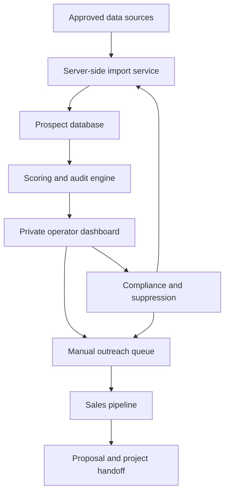

# Website Prospecting System Plan

**Organization:** Derivative Genius  
**Purpose:** Build lead discovery, qualification, auditing, outreach management, and sales-pipeline capabilities directly into the company website.  
**Document status:** Foundational implementation specification  
**Version:** 1.0  
**Date:** August 17, 2026

---

## 1. Executive decision

Derivative Genius should add prospecting as a **private operator application inside the website**, not as a public lead directory.

The system should help an authorized operator:

1. Define a target industry and geography.
2. discover businesses from approved sources;
3. import public business information;
4. inspect and score each business;
5. identify the appropriate decision-maker;
6. prepare a personalized website audit;
7. manage manual calls and requested follow-up;
8. track proposals, sales, and revenue; and
9. enforce do-not-contact and data-retention rules.

The public website remains the sales and credibility layer. The prospecting application lives behind authentication at a route such as:

```text
https://YOUR-DOMAIN.com/centurion/prospects
```

Recommended route structure:

```text
/services/websites                 Public website-client offer
/website-audit                     Public inbound audit request
/case-studies                      Public proof and results
/centurion                         Private operator dashboard
/centurion/prospects               Private prospect database
/centurion/campaigns               Private market and outreach queues
/centurion/audits                  Private audit builder
/centurion/pipeline                Private sales pipeline
/centurion/compliance              Private suppression and audit logs
```

> **Critical rule:** Prospect records, private notes, enrichment data, internal scores, and outreach history must never be exposed through public pages, search engines, client-side application bundles, or unauthenticated APIs.

---

## 2. Business objective

The system exists to sell fixed-scope website engagements between **$2,000 and $5,000** to established companies for which one or a few new customers can justify the investment.

The system is not designed to maximize the number of phone numbers collected. It is designed to maximize the number of **qualified commercial conversations** produced per operator hour.

### Primary success metrics

| Metric | Definition |
|---|---|
| Raw prospects | Businesses discovered but not yet qualified |
| Qualified prospects | Businesses scoring at least 60 with no disqualifier |
| Priority prospects | Businesses scoring at least 75 |
| Decision-maker conversations | Relevant people reached and engaged |
| Audits accepted | Prospects agreeing to receive or review an audit |
| Discovery calls held | Completed sales-discovery meetings |
| Proposals issued | Formal scopes and prices delivered |
| Closed-won projects | Signed agreement and required deposit received |
| Pipeline value | Sum of weighted active opportunities |
| Acquisition cost | Data, labor, and software cost per closed client |

### Initial verticals

- HVAC
- roofing
- plumbing
- electrical contracting
- tree service
- restoration
- remodeling and general contracting
- pest control
- dental practices
- med spas
- law firms
- property management
- commercial cleaning

The first release should support any vertical, but the first campaign should use **one vertical across approximately five cities**. This creates comparable data and makes the sales message repeatable.

---

## 3. Recommended product architecture

The simplest reliable implementation is a Node-based web application integrated with the existing site.

### Recommended stack

| Layer | Recommendation | Responsibility |
|---|---|---|
| Web application | Next.js with TypeScript | Public pages, private dashboard, server actions, API routes |
| Authentication | Clerk, Auth.js, or the site's existing provider | User identity, sessions, roles, protected routes |
| Database | PostgreSQL | Prospects, contacts, audits, activities, campaigns, compliance |
| ORM | Drizzle ORM or Prisma | Typed schema, migrations, safe data access |
| Background jobs | Trigger.dev, Inngest, or a controlled worker | Imports, rechecks, audit generation, scheduled internal tasks |
| Object storage | S3-compatible storage | Screenshots, audit images, proposal attachments |
| Email | Postmark, Resend, or existing transactional provider | Requested audits and transactional notices |
| Maps/business data | Google Places API | Approved business discovery and Place Details |
| Contact enrichment | Apollo, used selectively | Decision-maker and business-contact enrichment |
| Analytics | PostHog or first-party event tables | Funnel and operator-performance measurement |
| Error monitoring | Sentry or equivalent | Production exceptions and job failures |

These are replaceable components. Existing site services should be reused when they already satisfy the requirement.

### System topology



### Architectural boundaries

The following operations must run on the server:

- Google Places and Apollo API requests;
- API-key access;
- prospect imports;
- duplicate detection;
- phone-number classification;
- website fetching and technical checks;
- scoring calculations;
- suppression checks;
- audit generation;
- activity logging; and
- exports.

Never place provider API keys in browser JavaScript or expose unrestricted proxy routes.

---

## 4. User roles and authorization

Start with a small, strict role model.

| Role | Permissions |
|---|---|
| `centurion_admin` | Full configuration, exports, user management, compliance, deletion |
| `prospector` | Discover, import, research, score, and assign prospects |
| `sales_operator` | View assigned prospects, log calls, create audits, manage opportunities |
| `viewer` | Read-only dashboards and reports |

### Required controls

- Default every new user to no private access.
- Assign roles only from an administrative server-side action.
- Enforce authorization in every API route and database query.
- Never rely exclusively on hiding buttons in the interface.
- Record privileged changes in an immutable audit log.
- Limit exports to administrators.
- Prevent ordinary operators from clearing suppressions or opt-outs.
- Require reauthentication for mass export or destructive actions.

---

## 5. Major application modules

## 5.1 Target Market Builder

The operator creates a market definition before collecting records.

Required fields:

```text
campaign_name
industry
service_categories[]
cities[]
state
postal_codes[]
radius_miles
minimum_review_count
minimum_rating
excluded_categories[]
target_customer_value
project_price_min
project_price_max
owner_user_id
status
```

The application should show the estimated number of raw businesses, but it must not promise that every result is a valid prospect.

## 5.2 Business Discovery

The discovery screen should support three controlled methods:

1. **Google Places search** using an approved API integration.
2. **CSV import** from lawful public directories or licensed data providers.
3. **Manual entry** for referrals, chamber members, and individually researched companies.

Each imported record must retain:

- source name;
- source URL or provider reference;
- source record identifier;
- capture timestamp;
- import user or job;
- original raw data snapshot or checksum; and
- applicable usage restrictions.

### Google Places workflow

1. Operator selects a campaign.
2. Server submits a Text Search request for the service and geography.
3. Server stores the Google Place ID and permitted fields.
4. Server requests Place Details only for selected candidates.
5. Application normalizes the name, address, public phone, website, rating, and review count.
6. Duplicate detection runs before insertion.
7. Operator reviews the candidate before it enters the active prospect queue.

Use the official service and review its current terms, field masks, attribution, storage limitations, and pricing:

- Google Places API: https://developers.google.com/maps/documentation/places/web-service
- Text Search: https://developers.google.com/maps/documentation/places/web-service/text-search
- Place Details: https://developers.google.com/maps/documentation/places/web-service/place-details
- Google Maps Platform pricing: https://mapsplatform.google.com/pricing/

> Do not build the core system around unauthorized Google Maps page scraping. Use the official API or a provider whose terms clearly permit the intended business use.

## 5.3 Deduplication and company identity

The same business may appear through multiple searches or providers.

Use the following match hierarchy:

1. provider Place ID or source ID;
2. normalized domain;
3. normalized public business phone;
4. normalized business name plus postal code;
5. business name plus street address; and
6. manual review for probable matches.

Do not automatically merge records when confidence is low. Present a comparison screen and preserve the provenance of both sources.

## 5.4 Website Inspection

The application should perform safe, limited checks against the prospect's public website.

### Automated checks

- domain resolves;
- HTTPS works;
- final URL after redirects;
- HTTP status;
- page title;
- meta description presence;
- viewport meta tag;
- visible phone link;
- visible form or booking link;
- obvious mixed-content or certificate error;
- homepage response time measured from the server;
- robots and sitemap availability; and
- screenshot capture for authorized internal analysis.

### Operator-reviewed checks

- mobile usability;
- offer clarity;
- call-to-action visibility;
- quote or booking friction;
- trust and review presentation;
- licensing and credentials;
- service-area coverage;
- portfolio quality;
- outdated content;
- accessibility risks;
- privacy and form risks; and
- commercial opportunity.

Automated checks must be rate-limited, identify the application appropriately where required, honor applicable site restrictions, and avoid vulnerability scanning. The product is a sales research tool, not a penetration-testing system.

## 5.5 Lead Scoring

The score must be transparent. An operator should be able to see exactly why a business received its score.

| Criterion | Points |
|---|---:|
| Customer value plausibly exceeds $1,000 | 20 |
| Weak or outdated website with a specific observed issue | 20 |
| At least 30 Google reviews | 15 |
| Clear decision-maker route | 10 |
| Multiple employees or locations | 10 |
| Active advertising or social presence | 10 |
| Missing or weak quote/booking workflow | 10 |
| Recent growth trigger | 5 |

Disposition:

- `75-100`: priority
- `60-74`: qualified nurture
- `40-59`: research only
- `<40`: exclude

Hard disqualifiers should override the score:

- permanently closed;
- inactive required license;
- poor reputation that makes a website project unsuitable;
- no evidence of current operations;
- existing do-not-contact instruction;
- current client conflict;
- vendor or legal restriction; or
- project need clearly outside the offer.

Every score should store its rule version. Changing the scoring model must not silently rewrite historical results.

## 5.6 Decision-Maker Enrichment

Apollo or another properly licensed provider should be used **after** company qualification.

Target roles:

- owner;
- founder;
- president;
- managing partner;
- marketing director or manager;
- operations manager; and
- business-development leader.

Provider links:

- Apollo: https://www.apollo.io/
- Apollo prospecting and enrichment: https://www.apollo.io/product/prospect-and-enrich
- Apollo pricing: https://www.apollo.io/pricing

Required workflow:

1. Operator clicks **Request enrichment**.
2. Server checks the prospect is qualified and not suppressed.
3. Server checks credit limits and permissions.
4. Provider results are stored separately from verified contacts.
5. Operator confirms the employer, role, and number type.
6. Only confirmed contacts enter an outreach queue.

The application must distinguish:

```text
public_business_line
business_direct_line
mobile
residential
unknown
```

Unknown or mobile numbers should not be placed into automated calling or texting workflows.

## 5.7 Personalized Audit Builder

The audit builder converts research into a useful sales asset.

Each audit should contain:

1. prospect name and website;
2. intended business outcome;
3. current strengths;
4. up to three observed conversion problems;
5. screenshots supporting each observation;
6. cautious explanation of the commercial consequence;
7. recommended improvements;
8. proposed project range or package; and
9. invitation to a short review call.

### Audit safeguards

- Do not invent traffic, conversion, ranking, or revenue-loss figures.
- Do not claim formal accessibility compliance based on an automated scan.
- Do not guarantee rankings, leads, or revenue.
- Do not publicly publish a prospect's negative audit.
- Keep internal screenshots private.
- Require human approval before sending an audit.

### Audit statuses

```text
draft
internal_review
approved
sent
viewed
meeting_requested
archived
```

## 5.8 Outreach Queue

The MVP should support **manual outreach management**, not mass automated calling or texting.

Queue cards should show:

- business name;
- public business phone;
- phone-type confidence;
- contact and role;
- lead score;
- primary observed issue;
- local time and permitted calling window;
- last activity;
- next recommended action;
- suppression status; and
- call script customized with the audit observation.

The operator clicks the call action, places the call manually, and records the result.

Suggested outcomes:

```text
no_answer
voicemail
gatekeeper
wrong_number
decision_maker_reached
audit_requested
meeting_booked
follow_up_requested
not_interested
do_not_contact
disqualified
```

Selecting `do_not_contact` must immediately create a suppression entry and prevent future queue generation.

## 5.9 Sales Pipeline

Recommended opportunity stages:

```text
qualified
contacting
engaged
audit_accepted
discovery_scheduled
discovery_completed
proposal_preparing
proposal_sent
negotiation
closed_won
closed_lost
on_hold
```

Opportunity fields:

```text
prospect_id
primary_contact_id
owner_user_id
stage
estimated_value
probability_percent
weighted_value
package
discovery_date
proposal_date
expected_close_date
loss_reason
next_action
next_action_at
created_at
updated_at
```

When a deal becomes `closed_won`, the application should create a project-handoff record rather than forcing fulfillment into the prospect tables.

## 5.10 Compliance Center

The compliance module must be a first-class feature, not a spreadsheet added later.

It should provide:

- internal do-not-contact list;
- phone and email suppressions;
- source and capture history;
- consent or outreach-basis records where applicable;
- number-type classification;
- contact attempts and outcomes;
- data-access and export log;
- retention and deletion queue;
- vendor/provider register; and
- policy-version history.

Federal resources:

- FCC robocalls and texts: https://www.fcc.gov/consumers/guides/stop-unwanted-robocalls-and-texts
- FCC telemarketing: https://www.fcc.gov/general/telemarketing
- FTC Telemarketing Sales Rule guidance: https://www.ftc.gov/business-guidance/resources/complying-telemarketing-sales-rule
- FTC Do Not Call Q&A: https://www.ftc.gov/business-guidance/resources/qa-telemarketers-sellers-about-dnc-provisions-tsr-0
- National Do Not Call Registry for telemarketers: https://telemarketing.donotcall.gov/

This document does not provide legal advice. Requirements may depend on the jurisdiction, number type, recipient, channel, dialing technology, message, relationship, time, and consent. Obtain qualified legal guidance before adding automated calls, prerecorded or AI voice, or marketing texts.

---

## 6. Proposed database model

Use UUID or another non-sequential public-safe identifier. All primary business records should include `created_at`, `updated_at`, and appropriate ownership fields.

### Core tables

```text
users
roles
user_roles

campaigns
campaign_geographies
campaign_categories

prospects
prospect_locations
prospect_sources
prospect_websites
prospect_scores
prospect_tags

contacts
contact_methods
contact_employments
enrichment_requests
enrichment_results

website_checks
website_findings
website_screenshots
audits
audit_findings
audit_deliveries

activities
call_attempts
meetings
tasks

opportunities
proposals
project_handoffs

suppressions
consent_records
data_deletion_requests
provider_register

audit_log
job_runs
integration_credentials
```

### Prospect table

```sql
prospects (
  id uuid primary key,
  legal_or_public_name text not null,
  normalized_name text not null,
  industry text,
  status text not null,
  qualification_status text not null,
  assigned_user_id uuid,
  current_score integer,
  score_version text,
  primary_website_id uuid,
  primary_location_id uuid,
  source_first_seen_at timestamptz,
  last_verified_at timestamptz,
  created_at timestamptz not null,
  updated_at timestamptz not null
)
```

### Contact method table

```sql
contact_methods (
  id uuid primary key,
  contact_id uuid,
  prospect_id uuid,
  method_type text not null,
  value_encrypted text not null,
  normalized_hash text not null,
  classification text not null,
  is_public_business_contact boolean not null default false,
  verification_status text not null,
  source_id uuid,
  last_verified_at timestamptz,
  created_at timestamptz not null
)
```

The normalized hash supports duplicate and suppression checks without exposing the original value in logs. Sensitive contact data should be encrypted at rest when practical and excluded from routine application telemetry.

### Suppression table

```sql
suppressions (
  id uuid primary key,
  scope text not null,
  normalized_value_hash text,
  prospect_id uuid,
  contact_id uuid,
  reason text not null,
  source text not null,
  effective_at timestamptz not null,
  expires_at timestamptz,
  created_by uuid,
  created_at timestamptz not null
)
```

Suppressions should normally be permanent unless a documented rule and lawful basis establish an expiration.

---

## 7. API and server-action design

Example internal routes:

```text
POST   /api/internal/campaigns
GET    /api/internal/campaigns/:id
POST   /api/internal/campaigns/:id/discover

POST   /api/internal/prospects/import
GET    /api/internal/prospects
GET    /api/internal/prospects/:id
PATCH  /api/internal/prospects/:id
POST   /api/internal/prospects/:id/verify
POST   /api/internal/prospects/:id/score
POST   /api/internal/prospects/:id/enrich

POST   /api/internal/prospects/:id/website-check
POST   /api/internal/prospects/:id/findings
POST   /api/internal/prospects/:id/audits
POST   /api/internal/audits/:id/approve
POST   /api/internal/audits/:id/send

POST   /api/internal/activities
POST   /api/internal/calls
POST   /api/internal/meetings

POST   /api/internal/opportunities
PATCH  /api/internal/opportunities/:id
POST   /api/internal/proposals

GET    /api/internal/compliance/suppressions
POST   /api/internal/compliance/suppressions
POST   /api/internal/compliance/deletion-requests
```

### API rules

- Authenticate every request.
- Authorize the action and the record scope.
- Validate all input with a schema library such as Zod.
- Apply rate limits by user, route, provider, and campaign.
- Use idempotency keys for imports, provider requests, and audit delivery.
- Prevent mass assignment of privileged fields.
- Never return API credentials or raw provider payloads to the browser.
- Log privileged actions without logging secrets or unnecessary personal data.
- Run suppression checks immediately before any delivery or queue action.

---

## 8. Background jobs

Use background jobs only for bounded, observable tasks.

| Job | Trigger | Safeguard |
|---|---|---|
| `discover_places` | Operator-approved campaign search | Provider quota and geographic limits |
| `fetch_place_details` | Selected discovery results | Field mask and budget limit |
| `deduplicate_import` | Every import | Confidence threshold and manual-review queue |
| `check_website` | Operator request or controlled batch | Per-domain rate limit and timeout |
| `capture_screenshot` | Approved website check | Private storage and expiration policy |
| `recalculate_score` | Finding or rule update | Store score version and explanation |
| `enrich_contact` | Operator request | Qualification, credit, and suppression checks |
| `generate_audit` | Approved findings | Human review required before delivery |
| `retention_review` | Scheduled | Never delete records on ambiguous policy |

Every job should record:

```text
job_name
job_run_id
requested_by
campaign_id
prospect_id
started_at
completed_at
status
attempt_count
provider_cost
records_processed
error_code
safe_error_summary
```

Failed jobs should be retryable without producing duplicate prospect, activity, or delivery records.

---

## 9. User-interface specification

## 9.1 Dashboard

Display:

- prospects added this week;
- qualification rate;
- priority prospects;
- calls due today;
- overdue follow-ups;
- audits awaiting review;
- meetings scheduled;
- proposals outstanding;
- weighted pipeline value;
- closed revenue; and
- suppression or integration warnings.

## 9.2 Prospect list

Filters:

- campaign;
- industry;
- city/state;
- score range;
- review count;
- website condition;
- license status;
- assigned operator;
- pipeline stage;
- next-action date;
- contact availability; and
- suppression status.

Bulk actions should be conservative. Allow tagging and assignment, but do not permit bulk calling, texting, audit delivery, or suppression removal.

## 9.3 Prospect detail

Recommended tabs:

```text
Overview
Website
Contacts
Score
Audit
Activities
Opportunity
Compliance
Source History
```

Place the suppression status and next action where they cannot be missed.

## 9.4 Daily queue

The daily queue should answer one question: **What is the next safe, valuable action?**

Order items using:

1. scheduled follow-up commitment;
2. engaged prospect activity;
3. accepted audit or scheduled discovery;
4. priority lead score;
5. recent growth trigger; and
6. record age.

Never use engagement pressure or repeated calls to override an opt-out.

---

## 10. Public website integration

The public website should support inbound conversion and establish credibility for outbound prospects who research Derivative Genius after a call.

### Required public pages

#### Website services page

Explain:

- who the service is for;
- the business outcome;
- the three project packages;
- what is and is not included;
- project process;
- indicative timeline;
- starting price or range;
- maintenance options; and
- consultation action.

#### Website-audit request page

Collect only what is required:

```text
name
business_name
business_email
business_phone_optional
website_url
primary_business_goal
permission_to_review_public_website
preferred_contact_method
privacy_acknowledgment
```

Marketing consent must not be bundled deceptively with service delivery. Store the consent text and version shown at submission.

#### Case studies

Each case study should distinguish:

- baseline;
- work completed;
- measurement period;
- observed result;
- limitations; and
- client approval to publish.

Do not fabricate case studies or imply causation that the data does not establish.

### Public/private data separation

The public site may show aggregated, anonymized capability metrics. It must not reveal:

- prospect names without permission;
- internal audit findings;
- call history;
- decision-maker contact data;
- enrichment data;
- lead scores;
- proposal details; or
- suppression records.

---

## 11. Security and privacy requirements

- Keep integration secrets in the deployment secret manager.
- Encrypt sensitive contact values where practical.
- Use HTTPS everywhere.
- Apply Content Security Policy and secure session cookies.
- Protect internal routes from indexing and unauthenticated access.
- Use least-privilege database credentials.
- Separate production and development data.
- Do not copy production prospect records into local fixtures.
- Redact contact details from error logs.
- Apply export limits and watermark or log exported files.
- Back up the database and test restoration.
- Establish retention and deletion procedures.
- Review provider contracts, privacy terms, and data-use rights.
- Complete a threat model before adding browser extensions, dialers, or automatic messaging.

### Threats to address

| Threat | Control |
|---|---|
| Unauthenticated prospect access | Server-side authentication and authorization |
| Operator downloads entire database | Role-based export, step-up authentication, audit log |
| API-key theft | Server-only keys, secret rotation, provider restrictions |
| Duplicate or runaway provider charges | Quotas, budgets, idempotency, approval gates |
| Outreach after opt-out | Central suppression checked at queue and send time |
| Private data in analytics | Event allowlist and data redaction |
| SSRF through website checker | URL validation, DNS/IP controls, egress restrictions |
| Malicious site response | Timeouts, size limits, sandboxed parsing, no script execution |

The website-checking service requires special protection against server-side request forgery. Block localhost, private networks, link-local addresses, cloud metadata endpoints, non-HTTP protocols, redirect-to-private-address behavior, and oversized responses.

---

## 12. Analytics and reports

The application should measure the funnel by campaign, industry, geography, source, score band, and operator.

### Required reports

1. Source quality report
2. Qualification report
3. Contact and conversation report
4. Audit acceptance report
5. Meeting and proposal report
6. Closed revenue report
7. Loss-reason report
8. Provider-cost report
9. Compliance and suppression report
10. Aging and overdue-action report

### Avoid vanity metrics

Raw record count, emails found, and calls attempted are operating counts. They are not business outcomes. Management decisions should emphasize:

- qualified-conversation rate;
- discovery rate;
- proposal rate;
- close rate;
- average project value;
- gross margin;
- acquisition cost; and
- revenue by source and niche.

---

## 13. MVP scope

The first release should remain deliberately narrow.

### MVP includes

- authenticated private dashboard;
- campaigns and geography definitions;
- CSV and manual import;
- optional Google Places discovery;
- deduplication;
- prospect detail pages;
- manual website findings;
- transparent lead scoring;
- manual contact entry;
- activity and task tracking;
- manual call queue;
- audit builder;
- opportunity pipeline;
- central suppression list;
- CSV export restricted to administrators; and
- core funnel reports.

### MVP excludes

- automatic cold texting;
- prerecorded or AI cold calls;
- autonomous email sequences;
- automatic publishing of prospect audits;
- mass enrichment;
- vulnerability scanning;
- unapproved Google scraping;
- automated proposal negotiation;
- complex multi-tenant client access; and
- custom project-fulfillment management.

This boundary gets the revenue workflow operating while limiting compliance, cost, and engineering risk.

---

## 14. Phased implementation

### Current implementation status: pilot-readiness review

The initial Centurion foundation failed the Phase 1 exit criterion during an August 19, 2026 code review. DT-19 has now implemented the required manual-workflow remediation and pushed its additive schema to live Neon.

Centurion now provides:

- explicit Clerk roles inside every private data action and administrator-only exports;
- keyed suppression hashing and transactional opt-outs;
- campaign-assigned, source-aware imports with human-confirmed qualification evidence;
- due-first manual call queues with complete outcomes, notes, owners, and dates;
- approved audit review, opportunities, proposals, and project handoffs;
- work-session, funnel, and weighted-pipeline reporting from real records; and
- a reviewable additive migration in `drizzle/manual/centurion_pilot_readiness.sql`.

The sole remaining Phase 1A exit check is Joe Terry's signed-in end-to-end readiness test with disposable test data. DT-18 remains blocked until that checklist passes.

This is manual-workflow remediation, not an expansion into automated outreach.

### Phase 0: Decisions and safeguards

**Duration:** 2-4 working days

- Confirm the domain and existing technical stack.
- Confirm authentication and administrator identity.
- Select PostgreSQL host and ORM.
- Approve the initial vertical and five cities.
- Define retention, suppression, export, and outreach policies.
- Confirm which providers are permitted.
- Establish development, staging, and production environments.

**Exit criterion:** architecture and policy decisions are documented; no provider key is required in browser code.

### Phase 1: Prospect database and manual workflow

**Duration:** approximately 1-2 weeks

- Implement roles and protected routes.
- Create campaigns, prospects, sources, contacts, activities, tasks, scores, opportunities, and suppressions.
- Add CSV/manual import and deduplication.
- Build list, detail, scoring, and daily queue screens.
- Add audit logging and basic reports.

**Exit criterion:** an operator can manage 100 prospects end-to-end without external spreadsheets.

### Phase 1A: Centurion pilot readiness

**Duration:** complete before live outreach

- Reconcile implemented schema and screens with the Phase 1 contract.
- Complete server-side role checks and administrator-only exports.
- Add campaign-aware qualification, findings, contacts, tasks, and durable next actions.
- Replace score-only queue ordering with safe action priority.
- Complete manual audit, opportunity, proposal, and pilot-reporting workflows.
- Verify a 25-prospect test campaign end to end.

**Exit criterion:** every readiness check in `doc/the-first-priority.md` passes and DT-18 can begin without external tracking.

### Phase 2: Website audit and sales pipeline

**Duration:** approximately 1-2 weeks

- Add safe website checks and screenshots.
- Build findings and audit templates.
- Add approval and requested-email delivery.
- Add discovery, proposal, and project-handoff stages.

**Exit criterion:** a qualified prospect can move from research to approved audit to proposal with complete history.

### Phase 3: Approved discovery and enrichment integrations

**Duration:** approximately 1-2 weeks

- Add Google Places search and details.
- Add usage budgets and job observability.
- Add selective Apollo enrichment.
- Add provider-specific retention and provenance fields.

**Exit criterion:** the system can add and enrich controlled batches without duplicates, secret exposure, or unbounded charges.

### Phase 4: Optimization

- Improve scoring from actual sales results.
- Add source/niche performance comparisons.
- Add reusable audit finding templates.
- Add referral-partner tracking.
- Add maintenance and recurring-revenue handoff.
- Consider dialer or sequencing integrations only after legal and operational review.

---

## 15. Definition of done

The prospecting system is ready for its first production campaign when:

- every private route rejects unauthenticated users;
- every private action enforces the correct role;
- provider secrets remain server-side;
- imports preserve source and capture date;
- duplicates are detected and reviewable;
- the score is explainable and versioned;
- the website checker blocks private-network targets;
- audit delivery requires human approval;
- the daily queue excludes suppressed records;
- selecting do-not-contact suppresses future action immediately;
- all activities and privileged changes are logged;
- exports are restricted and logged;
- backup and restoration have been tested;
- provider quotas and spending limits are active;
- staging tests cover the full lead-to-proposal workflow; and
- the first campaign can be operated without a parallel private spreadsheet.

---

## 16. Recommended immediate build order

1. Confirm the current website repository and stack.
2. Add authenticated `/centurion` routes.
3. implement the database schema and migrations;
4. build campaigns, prospects, sources, and suppressions;
5. add manual/CSV import with deduplication;
6. build the scoring and daily-action queue;
7. add activities, discovery meetings, and opportunity stages;
8. build the audit template and human approval step;
9. test the complete process with 25 manually researched companies;
10. correct the data model and workflow based on real operator use;
11. add Google Places for controlled discovery; and
12. add selective contact enrichment only after qualification.

The 25-company manual pilot is essential. It reveals missing fields, incorrect scoring assumptions, and workflow friction before paid provider APIs and background automation make those mistakes more expensive.

---

## 17. Final operating principle

The website prospecting system should act as a disciplined decision engine:

```text
Discover narrowly
Verify the business
Identify a real website problem
Score transparently
Contact respectfully
Record every outcome
Honor every opt-out
Measure revenue, not list size
```

Built this way, the website becomes both the public proof of Derivative Genius and the private operating system that converts market research into qualified $2,000-$5,000 website projects.
