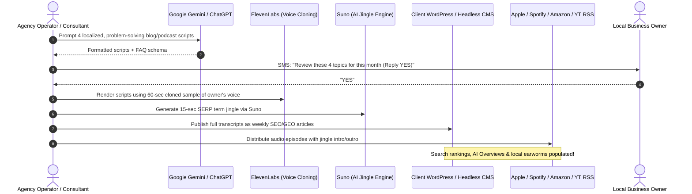

# Lessons of Local Internet Presence: The Mike Stewart Playbook

> A comprehensive distillation of the strategies, direct-response principles, cognitive mechanisms, VSL architecture, and AI production workflows behind [LocalInternetPresence.com](https://localinternetpresence.com) and Mike Stewart's 35-year direct marketing methodology.

**Target File:** [`doc/lessons-of-localinternetpresence.md`](file:///home/knowself/dev/dg-web/doc/lessons-of-localinternetpresence.md)  
**Subject:** Deep Analysis of Mike Stewart's Local Internet Presence Architecture, Direct Response Heritage, and AI Workflows  
**Domain:** Local SEO, Generative Engine Optimization (GEO), Video Sales Letters (VSL), Audio Direct Response, Cognitive Earworms, and Hyper-Local Ad Arbitrage  
**Source Material:** [LocalInternetPresence.com](https://localinternetpresence.com) & Full Interview Transcript with Chris Koerner (*The Koerner Office*, 2026)  
**Relevance to Derivative Genius:** Prospecting intelligence, conversion architecture, and client acquisition workflows for `/centurion` and `derivativegenius.com`

---

## 1. Executive Summary & Core Philosophy

Mike Stewart is a 35-year veteran of radio, television, music production, audio engineering, and direct marketing based in Nashville, Tennessee. A former member of the classic pop band *The Box Tops*, co-producer of the hit record *Pac-Man Fever*, and producer of all Waffle House jukebox records (earning a Golden Waffle for "Raisin Toast"), Mike stands as one of the original pioneers of internet multimedia.

Over 20 years ago, alongside copywriter Jim Edwards and direct-response titan Dan Kennedy, Mike **co-invented the Video Sales Letter (VSL)** when Flash video was first introduced, proving that direct-response psychology and human video crush multi-million-dollar corporate agency websites.

His company, [LocalInternetPresence.com](https://localinternetpresence.com), represents a battle-tested counterweight to modern "digital agency" vanity.

### The Foundational Thesis
> *"Rather than posting a lot of jargon on this website that means nothing to most business owners... To GROW your business today, you must have a local internet presence. What I do for businesses, no one else is doing."*

Where conventional digital agencies sell abstract "brand awareness", vanity aesthetics, and aimless social media management, Mike Stewart focuses on **high-intent lead capture**, **auditory brand retention (earworms)**, and **frictionless conversion funnels** engineered specifically for local service businesses (pest control, plumbers, roofers, HVAC, boat rentals, niche retailers).

### The Traffic & Conversion Axiom
Mike simplifies the entire digital economy down to two fundamental variables:
1. **Traffic:** Getting qualified local prospects to discover you on whatever device they use (**>90% mobile phones** for local home services). There are only three ways to acquire traffic:
   - **Paid Traffic:** Google PPC & YouTube Ads (fastest, guaranteed, controllable).
   - **Organic Traffic:** SEO, Google Business Profile, and GEO (compounding, durable).
   - **Borrowed Traffic:** Affiliates, partners, and local networking referrals.
2. **Conversion:** Within **3 seconds** of landing on your web asset, is the customer convinced you are the trustworthy local authority who can solve their urgent problem? If not, they bounce.

### The 2026 AI Paradigm Shift
For decades, Mike executed this playbook using high-end recording studios, professional Nashville session singers, and manual audio editing, charging clients $2,000+ upfront. With modern generative AI (**Gemini**, **ElevenLabs**, and **Suno**), he transformed an artisanal production process into an infinitely scalable, low-friction, high-margin monthly retainer ($300–$500/month) where the client does virtually zero heavy lifting.

---

## 2. The 5 Pillars of Local Internet Dominance

Rather than treating digital marketing as an ad-hoc collection of tactics, Mike organizes local dominance around five interdependent pillars:

```mermaid
graph TD
    A[Local Internet Presence] --> B[Pillar 1: Google Business Profile & Map Pack]
    A --> C[Pillar 2: Owned-Web Content & GEO Syndication]
    A --> D[Pillar 3: Conversion VSL Landing Pages & PPC]
    A --> E[Pillar 4: SERP Term Jingles & YouTube Pre-Rolls]
    A --> F[Pillar 5: Local Networking & Consultative 1-on-1s]
    
    B --> B1[Claim & Verify NAP]
    B --> B2[Drown Bad Reviews with 5-Stars]
    B --> B3[Owner Replies & Active Photos]
    
    C --> C1['Brain-to-Tongue' Voice Extraction]
    C --> C2[Full Transcripts as On-Site Blogs]
    C --> C3[Podcast RSS to Apple, Spotify, YT]
    
    D --> D1[Dan Kennedy Problem-Agitate-Solve]
    D --> D2[Universal Risk-Reversal Headline]
    D --> D3[Sticky Mobile Tap-to-Call Anchor]
    
    E --> E1[15-Sec SERP Term Earworm]
    E --> E2[5-Sec Skippable YouTube Arbitrage]
    E --> E3[Smart TV Living Room Saturation]
    
    F --> F1[In-Person & Chamber Networking]
    F --> F2[Diagnose Flaws via 1-on-1 Audits]
    F --> F3[Educational Value Selling]
```



### Pillar 1: Google Business Profile (GBP) & Map Pack
The single most valuable digital asset for any local business.
- **Claim, Verify & Complete:** Ensure full ownership, correct category mapping, and strict NAP (Name, Address, Phone) consistency.
- **The "Drown Out" Review Engine:** Negative reviews cannot be deleted; they must be drowned out. Establish a permanent operational habit of asking every satisfied customer for a 5-star review.
- **Algorithmic Activity Signals:** Google prioritizes businesses that actively maintain their profile. Responding to every review and frequently uploading real-world job photos and short videos signals to Google's ranking algorithms that the business is thriving.

### Pillar 2: Owned-Web Content, Syndication & Generative Engine Optimization (GEO)
Local search is transitioning from static keyword matching to semantic question-answering powered by LLMs (Google Gemini, ChatGPT, Claude, Perplexity).
- **The Open Web vs. Rented Land:** Content published inside social media "walled gardens" (Facebook, Instagram) is largely invisible to web spiders and AI training crawlers. Content published on your own domain URL builds permanent indexing equity.
- **The "Brain to Tongue" Law:** It is easier to record and transcribe than to write. Local owners freeze when asked to write a blog post. By recording their natural spoken answers to customer questions and publishing full transcripts, businesses build deep semantic authority.
- **Automatic High-Authority Backlinks:** Distributing the transcribed audio feed via RSS to Apple Podcasts, Spotify, Amazon Music, and YouTube generates authoritative backlinks from the most trusted domains on the internet.

### Pillar 3: High-Converting Video Landing Pages & Search Intent Ads
Paid traffic without conversion architecture is wasted capital.
- **The VSL Formula:** Replace bloated multi-page websites with focused, 1-page direct-response Video Sales Letters.
- **Problem-Agitate-Next Step Copy:** Align ad headlines directly with urgent customer pain points.
- **Zero-Friction Mobile CTA:** Eliminate multi-level navigation and place a sticky "Tap to Call" button directly in the mobile thumb zone.

### Pillar 4: The SERP Term Jingle & YouTube Pre-Roll Arbitrage
Exploiting auditory cognitive science and Google's advertising billing loophole:
- **Involuntary Musical Imagery (INMI):** Anchor the business's primary search phrase in the prospect's subconscious using a 15-second musical earworm.
- **5-Second Skippable YouTube Ads:** Front-load the brand and SERP term in the mandatory 5-second viewing window. Google charges $0 when viewers skip before 30 seconds, delivering millions of free brand impressions on living room Smart TVs.

### Pillar 5: Local Networking & Consultative 1-on-1s
Small business owners "don't know what they don't know." They are inundated with spam pitches from faceless overseas agencies.
- **In-Person Networking (BNI, Chambers, Connect Groups):** Face-to-face trust allows you to sit down with decision-makers for a 20-minute 1-on-1 audit.
- **The Diagnostic Demonstration:** Showing a local owner that their $5,000 website has a 90% bounce rate, lacks a tap-to-call button, and ignores its Google Business Profile creates instant urgency and closes high-retention monthly retainers.

---

## 3. The Signature Proprietary Weapons

### Weapon A: The "SERP Term Jingle" & Earworm Cognitive Science

Every business has a specific 2-to-4-word phrase that triggers them at #1 on Google (e.g., *"Nashville Party Boat Rental"*, *"Pink Plumber"*, *"Mount Lawley Pest Control"*). The fatal challenge is that prospective customers in the local market do not know to type that exact phrase. Mike solves this by weaponizing **Involuntary Musical Imagery (INMI)**.

#### The 21-Repetition Cognitive Rule
> *"When you hear marketing information set to melody 20 times, on the 21st time you will never get it out of your subconscious for the rest of your life."*

- **The Pink Plumber Precedent:** 30 years ago in Smyrna, Georgia, a plumber whose wife survived breast cancer renamed his business *The Pink Plumber* and broadcast a simple radio jingle:  
  *“Google Pink, click the link, or call 404-222-PINK.”*  
  Decades later, listeners who haven't heard the commercial in 20 years still remember the exact phone number and search term.
- **National Proof Points:** Empire Today (*"800-588-2300 Empire Today"*), Hot Pockets, and Waffle House operate on this exact neuro-auditory mechanism.

#### The 15-Second Production Formula
The optimal jingle length is **strictly 15 seconds**, structured as:
1. **0s–5s (The Anchor):** The exact SERP term and core positioning statement sung with high energy. Must be fully delivered before a user can skip an ad.
2. **5s–12s (The Value Proposition):** Clear, plain-spoken statement of the primary customer benefit.
3. **12s–15s (The Call to Action):** Direct search prompt or phone anchor (*"Search [SERP Term] today!"*).

#### The Golden Production Rule
> **"We do not give clients a choice on production of the jingle, nor have I ever."**  
> Business owners invariably want to insert complicated slogans, awkward rhymes, or personal musical preferences that destroy the earworm effect. Mike mandates: *“We write the lyrics, we pick the music, and we follow the formula. We are the pros at this—trust us and don't help. If you don't like what we produce for free with AI, we'll produce whatever you want in a recording studio for $2,000.”*

---

### Weapon B: The 5-Second Skippable YouTube Pre-Roll Arbitrage

YouTube is the world's second-largest search engine, and more than 50% of local YouTube video viewing now occurs on **Connected Smart TVs in family living rooms**. Mike discovered an advertising loophole within Google Ads billing architecture:

```
[0s ──────────────── 5s] ───────── [6s ────────────────────────────── 30s+]
  MANDATORY VIEWING WINDOW                   SKIPPABLE WINDOW
  • 15-Sec SERP Term Jingle starts           • Deep problem breakdown
  • Brand + SERP term sung immediately       • Proof, reviews & offer
  • 100% OF VIEWERS HEAR THIS                • User can click "Skip Ad"
  ─────────────────────────                  ─────────────────────────
  BILLING: $0.00 (NO CHARGE)                 BILLING: Charged ONLY if watched
                                                      to 30s or clicked!
```

#### How the Arbitrage Operates
1. Google Ads skippable in-stream video ads force the viewer to watch the first **5 seconds** before the "Skip" button activates.
2. **The Google Billing Rule:** Google *does not charge* the advertiser for impressions that are skipped before 30 seconds (or before the video ends if shorter).
3. **The Play:** Front-load the video with the catchy SERP Term Jingle. State the brand, the local service, and the search term in the first 5 seconds.
4. **The Living Room Effect:** Stay-at-home parents and children watch YouTube content (like *Bluey*) on living room TVs. When the ad plays, the TV remote is on the coffee table; viewers rarely skip immediately. Even when 70–80% eventually skip, **every viewer has heard the jingle, brand name, and search term**.
5. **The Math:** In Abilene, Texas, a local pest control operator generated **8 million skips** (delivering ubiquitous, free local brand saturation) and **3 million full views** for pennies on the dollar ($200–$400/month in ad spend), completely dominating his market.

#### Ad Targeting Axiom: Geography Over Micro-Targeting
Mike rejects complex behavioral, demographic, or affinity micro-targeting on YouTube ads:
- **Do NOT over-filter:** Never restrict campaigns to narrow age brackets, parental status, or interests.
- **The Only Constraint:** Restrict geographic delivery to a tight **15–20 mile radius** or specific zip codes around the business.
- **Let the Algorithm Optimize:** Google's machine learning will find the active buyers far more efficiently than manual demographic guesswork.

---

### Weapon C: The Video Sales Letter (VSL) & Landing Page Architecture

Mike Stewart co-invented the VSL with Jim Edwards 20 years ago. Their foundational discovery: **"People will watch before they read."**

#### The 5-Element VSL Funnel Formula
```
┌─────────────────────────────────────────────────────────────┐
│ 1. Direct-Response Headline (Risk-Reversal Offer)           │
├─────────────────────────────────────────────────────────────┤
│ 2. 45–60 Second Problem-Solving Explainer Video + Jingle   │
├─────────────────────────────────────────────────────────────┤
│ 3. Social Proof Container (Google 5-Star Reviews / Badges)  │
├─────────────────────────────────────────────────────────────┤
│ 4. Plain-Spoken Sales Copy & Problem Agitation              │
├─────────────────────────────────────────────────────────────┤
│ 5. Persistent Mobile Sticky "Tap to Call" Button            │
└─────────────────────────────────────────────────────────────┘
```

#### The Universal Direct-Response Headline Formula
Tested across hundreds of local service websites for over 15 years with proven phone-ringing results:
> **"We will give you the most thorough, amazing, unbelievable [Service] service guaranteed or it's free."**
- *HVAC:* "We will make your house ice cold or it's free."
- *Plumbing:* "We will fix your leaky toilet today guaranteed or it's free."
- *Roofing:* "Your roof will not leak, guaranteed or it's free."

**The Psychology of Risk Reversal:** Local homeowners searching for emergency repairs are anxious about getting ripped off. This headline eliminates buyer friction. In 15 years, Mike notes that virtually nobody asks for a refund—customers just want to feel safe and protected.

#### Dan Kennedy's "Watch My Video" PPC Ad Formula
When driving Google Ads traffic to these landing pages, Mike structures ad copy using Dan Kennedy's **Problem → Agitate → Next Step** sequence:
> *"Tired of termites? Scared termites are eating your home? Want them gone and solved today? Watch my video."*

Adding the specific instruction **"Watch my video"** to the Google Ad headline and description **quadrupled click-through rates (CTR)** because it promises immediate visual clarity over dense sales text.

---

### Weapon D: The "Brain to Tongue" Content Machine

The greatest obstacle in local business marketing has always been getting the owner to produce content. Business owners are busy running crews, managing trucks, and fixing problems. They freeze when asked to sit at a keyboard.

#### The Cognitive Law of Content Creation
> *"It is a much shorter distance from your brain to your tongue than it is from your brain to your hands."*

#### The Content Extraction Protocol
1. **Never ask them to write:** Instead, ask them: *"Name 50 specific problems your business solves."*
2. **Deconstruct generic categories:** If an exterminator says *"We kill bugs"*, reject it. Break it down: subterranean termites, drywood termites, bedbugs, German cockroaches, brown recluse spiders, roof rats.
3. **Ask the Diagnostic Question:** Ask: *"What are subterranean termites, and why are they dangerous to a home's foundation?"*
4. **Capture the Stream:** Once asked a technical question about their craft, an owner cannot be shut up. Record the 3-minute explanation.
5. **Transcribe & Syndicate:** Transcribe the spoken audio into a rich, semantic blog post on the primary website URL, and syndicate the audio as a weekly podcast episode.

---

## 4. The AI Production Revolution & Retainer Economics

Modern AI has completely eliminated the studio bottlenecks that previously required thousands of dollars in equipment and manual engineering:



### The Tech Stack
1. **Script Drafting (Google Gemini):** Drafts hyper-local, question-answering scripts tailored to specific regional search queries (e.g., *"How to prepare your Donelson lawn for spring weeds"*). Gemini is preferred due to its native alignment with Google search intent.
2. **Audio Synthesis (ElevenLabs):** With a 1-minute voice sample, ElevenLabs renders natural-sounding episodes in the owner's authentic tone—and can instantly dub into Spanish for bilingual local markets.
3. **AI Earworm Production (Suno):** Prompts generate catchy, genre-appropriate 15-second jingles incorporating the exact SERP terms within minutes, replacing $2,000 Nashville studio sessions.
4. **Open Syndication Engine (WordPress + PowerPress / Libsyn):** Distributes the audio feed automatically across Apple Podcasts, Spotify, Amazon Music, and YouTube.
5. **On-Site Publishing:** Embeds the audio player and publishes the full transcript as a semantic blog post with complete JSON-LD schema on the client's website.

---

## 5. Critical Contrarian Critiques & Industry Traps

### Critique 1: The "Award-Winning Website" Trap
Mainstream web design agencies build sites designed to win design awards rather than generate incoming phone calls:
- **Negative Indicator of Conversion:** Mike argues that an award-winning web design is usually a *negative indicator* of commercial conversion.
- **The Wasted Hero Real Estate:** Giant full-screen photo sliders and heavy video backgrounds push the core value proposition, proof, and phone number far below the fold.
- **The 90% Bounce Rate Reality:** Most local business websites suffer from a 90% bounce rate. Visitors arrive, get confused by vague corporate slogans (*"Excellence in Every Pipe"*), cannot locate pricing or phone numbers, and leave within 10 seconds.
- **The "Hamburger Menu" Folly:** Local service prospects visiting on mobile phones in an emergency should never be forced to navigate a multi-tiered menu. As Mike jokes: *"Ask a baby boomer what a hamburger menu is—they think of In-N-Out."* Put a sticky tap-to-call button at the bottom of the screen.

### Critique 2: The Social Media "Walled Garden" Trap
Local businesses frequently waste money hiring social media managers to post generic graphics on Instagram or Facebook:
- **Low Intent vs. Urgent Pain:** People browse social media feeds for entertainment and dopamine. Nobody browses Instagram when their sewer pipe bursts or a rat runs across their kitchen floor. They go to **Google**.
- **The Walled Garden Problem:** Content posted inside Facebook and Instagram lives behind login walls. It is invisible to Googlebot, OpenAI's GPTBot, and Common Crawl.
- **Compounding Equity:** Blogs, podcasts, transcripts, and RSS feeds live on public web protocols. They are indexed by search engines and ingested by AI models, building lasting equity that generates inbound calls years after publication.

---

## 6. Documented Case Studies & Real-World Proof

### Case Study 1: West Texas Pest Patrol (Wendell – Abilene, TX)
- **Strategy:** Produced a 15-second custom SERP jingle (*"Google West Texas Pest Patrol... no bug will survive"*), launched skippable YouTube pre-roll ads targeting only the Abilene geographic radius.
- **Results:** Generated **8 million skips** (delivering ubiquitous, free auditory brand saturation) and **3 million full views**. Local families reported hearing the jingle in the background daily while their kids watched *Bluey* on living room TVs. Gross revenue tripled and quadrupled.

### Case Study 2: Nashville Party Boat Rental (Jason – Nashville, TN)
- **Challenge:** A pontoon boat captain's charter season was wiped out in May when his previous employer abruptly dissolved during a divorce.
- **Strategy:** Secured the exact high-volume domain `nashvillepartyboatrental.com`, built a streamlined 1-page VSL website with one clear CTA (*"Book Your Boat"*), produced an AI SERP jingle, and launched a $250/month hyper-local Google Ads campaign.
- **Results:** Scaled from **$0 to $80,000 in revenue in its first summer**, booking 40 charters in year one and selling out every weekend. Ranked #1 in Google Map Pack and organic search.

### Case Study 3: Local Nashville Honey (Susan Stewart – Nashville, TN)
- **Challenge:** Selling artisanal local honey through a physical retail booth without doing complex e-commerce shipping.
- **Strategy:** Acquired `localnashvillehoney.com`, published regular localized content about Tennessee honey varietals and seasonal allergies, and produced a custom AI jingle.
- **Results:** Ranked **#1 across Nashville for *"local honey near me"***. Foot traffic to the retail booth surged, generating the biggest sales months in company history with zero ad spend.

### Case Study 4: Mount Lawley Pest Control (Glenn Mott – Perth, Australia)
- **Challenge:** Solo pest control operator setting a 5-year goal to reach $500,000 in annual revenue.
- **Strategy:** Deployed problem-specific Video Landing Pages, a custom SERP jingle, and synchronized Google Ads campaigns using Dan Kennedy agitation copy.
- **Results:** Achieved his 5-year revenue target in his **second year**—3 years ahead of schedule.

### Case Study 5: Haynes Pest Control (Ryan Kenneth Haynes – Avon Park, FL)
- **Strategy:** Implemented the full VSL landing page framework, 15-second SERP jingle, and skippable YouTube ads with 50% Connected TV viewership.
- **Results:** Grew gross revenue by **23% (+$172,500)** in 7 months; added 7 new employees in 2025; surpassed 1,000,000 online video views.

### Case Study 6: The Agency Affiliate Model (Ted Yates – Tampa, FL)
- **Challenge:** Testing whether this playbook can be transferred to an operator without audio engineering or coding skills.
- **Strategy:** Mike conducted two 1-hour Zoom training sessions with his partner's nephew, Ted Yates.
- **Results:** Ted launched a full-time local marketing agency in Tampa exclusively through local BNI/networking groups, signing recurring retainer clients and hosting podcasts for local organizations.

---

## 7. The Business Model, Unit Economics & The Million-Dollar Math

The commercial model is built on low overhead, predictable recurring revenue, and rapid fulfillment:

```
┌─────────────────────────────────────────────────────────────┐
│ CORE RETAINER: $300 / month                                 │
├─────────────────────────────────────────────────────────────┤
│ • Weekly keyword blog posts published to client domain      │
│ • Weekly transcribed audio podcast syndicated to 5 networks │
│ • Google Business Profile (GBP) ongoing optimization        │
│ • Custom 15-second SERP Term Jingle (AI-generated) included │
└──────────────────────────────┬──────────────────────────────┘
                               │
                               ▼ UPSELL
┌─────────────────────────────────────────────────────────────┐
│ FULL-SERVICE GROWTH RETAINER: $500 / month ($300 + $200)    │
├─────────────────────────────────────────────────────────────┤
│ • Everything in the Core Retainer                           │
│ • Google PPC Ad Campaign setup & hyper-local management     │
│ • Skippable YouTube Video Pre-Roll Ad management            │
│ • Monthly 1-on-1 Zoom performance review & strategy session │
│ • (Client pays ad spend directly to Google, typically $250+)│
└─────────────────────────────────────────────────────────────┘
```

### The "300 Customer" Million-Dollar Math
Mike breaks down the enterprise scaling potential:
- **300 Retainer Clients @ $300/month = $90,000/month = $1,080,000/year ARR.**
- **Fulfillment Time:** Using modern AI workflows, total production time per client is **15 to 20 minutes per month**.
- **Outsourcing:** The entire content generation, voice synthesis, and syndication pipeline can be handed off to a trained remote operations team (e.g., in the Philippines), leaving the founder focused purely on relationship-building and local sales.

### The Lifestyle / Side-Hustle Economics
- **Comparison to Traditional Retirement:** Generating $50,000/year in safe retirement income requires a $1.2M to $1.5M investment portfolio (which less than 4% of Americans possess).
- **The Local Marketing Alternative:** Just **15 local clients at $500/month generates $90,000/year in recurring cash flow** on approximately 4 to 6 hours of total work per month.

---

## 8. Strategic Applications for Derivative Genius & `/centurion`

The Mike Stewart playbook provides direct architectural blueprints for Derivative Genius, our design system, and the `/centurion` prospecting workflow:

### 1. Prospecting Intelligence & Automated Audit Vectors
When `/centurion` scans local business prospects, our audit engine should score these specific failure points:
- [ ] **The Homepage Mistake:** Does their paid Google Ad link to their cluttered homepage instead of a problem-specific landing page? (Prime direct-outreach trigger).
- [ ] **The Missing Tap-to-Call Anchor:** Does their mobile site lack a persistent, sticky click-to-call button at the bottom of the screen?
- [ ] **The Hero Image Penalty:** Does the hero section waste vertical real estate on slow photographic sliders while hiding reviews and phone numbers under the fold?
- [ ] **The Google Business Profile Void:** Do they have fewer than 20 reviews, unaddressed 1-star ratings, or zero owner replies?
- [ ] **The Walled Garden Trap:** Are they posting content only to Facebook/Instagram while having zero indexed blog articles or audio podcasts on their owned domain?

### 2. The Video Landing Page Standard for Client Builds
Every client site deployed by Derivative Genius must adhere to the 5-element VSL formula:
1. **Headline:** Dan Kennedy risk-reversal offer (*"Guaranteed or it's free"*).
2. **Video:** 60-second founder explainer addressing the customer's exact search intent.
3. **Proof:** Live Trustindex / Google 5-star review carousel immediately below the video.
4. **Copy:** Problem-agitation breakdown with structured FAQ schema.
5. **Mobile Action:** Persistent, unmissable tap-to-call button anchored to the bottom viewport.

### 3. Generative Engine Optimization (GEO) Pipeline
To ensure our clients dominate AI Overviews in Google Gemini, ChatGPT, and Claude:
- Always publish full, verbatim text transcripts alongside any audio/video media.
- Embed rich JSON-LD schema (`LocalBusiness`, `Service`, `FAQPage`, `Review`, `VideoObject`).
- Structure content around hyper-local, conversational question queries (e.g., *"How much does emergency slab leak repair cost in [City]?"*).

### 4. "Eat Your Own Cooking" (The Derivative Genius Showcase)
Before selling these systems to clients, `derivativegenius.com` must embody them:
- **Founder VSL:** A high-converting 60-second video of Joe Terry explaining how Derivative Genius builds websites that actually make the phone ring.
- **The Auditory Proof of Concept:** A custom 15-second Suno-produced SERP term jingle featured prominently on the site to prove the power of Involuntary Musical Imagery in real time.
- **Sticky Mobile Tap-to-Call:** Zero-friction mobile dialing permanently anchored in the thumb zone.

### 5. Active Operational Cross-References
* **Offer Packaging & Retainer Tiers:** [DT-01 in `doc/current-development-targets.md`](file:///home/knowself/dev/dg-web/doc/current-development-targets.md#dt-01-define--approve-ai-first-web-development--local-presence-offerings--claims-register)
* **Dual-Engine SEO & GEO Architecture:** [DT-07 in `doc/current-development-targets.md`](file:///home/knowself/dev/dg-web/doc/current-development-targets.md#dt-07-establish-seo-geo-analytics-privacy-and-operational-baselines)
* **Core Operating Charter & Anti-Agency Doctrine:** [`doc/The-Mission.md`](file:///home/knowself/dev/dg-web/doc/The-Mission.md)
