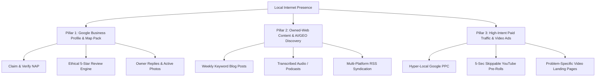
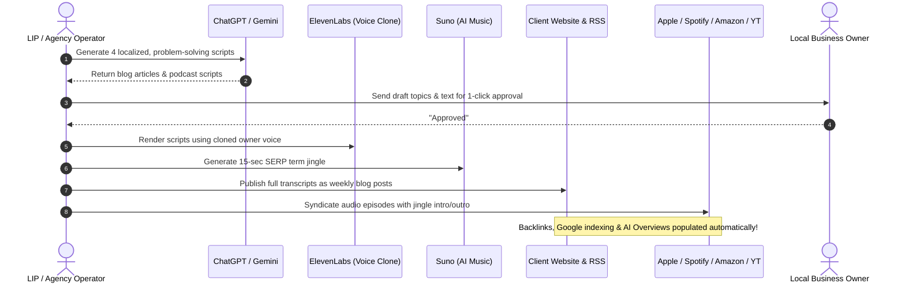

# Lessons of Local Internet Presence: The Mike Stewart Playbook

> A comprehensive distillation of the strategies, direct-response principles, psychological mechanisms, and AI production workflows behind [LocalInternetPresence.com](https://localinternetpresence.com) and Mike Stewart's 30-year local marketing methodology.

**Target File:** [`doc/lessons-of-localinternetpresence.md`](file:///home/knowself/dev/dg-web/doc/lessons-of-localinternetpresence.md)  
**Subject:** Analysis of Mike Stewart's Local Internet Presence Architecture, Services, and Systems  
**Domain:** Local SEO, Generative Engine Optimization (GEO), Video Landing Pages, Audio Direct Response, and Hyper-Local Ad Arbitrage  
**Relevance to Derivative Genius:** Prospecting intelligence, conversion architecture, and client acquisition workflows for `/centurion`

---

## 1. Executive Summary & Core Philosophy

Mike Stewart is a 30-year veteran of radio, professional music production, audio engineering, and direct marketing based in Donelson/Nashville, Tennessee. His platform, [LocalInternetPresence.com](https://localinternetpresence.com), represents a battle-tested, pragmatic counterweight to modern "digital agency" bloat.

### The Foundational Thesis
> *"Rather than posting a lot of jargon on this website that means nothing to most business owners... To GROW your business today, you must have a local internet presence. What I do for businesses, no one else is doing."*

Where mainstream digital agencies sell abstract "brand awareness", vanity aesthetics, and aimless social media management, Mike Stewart focuses on **high-intent lead capture**, **auditory brand retention (earworms)**, and **frictionless conversion funnels** engineered specifically for local service businesses (pest control, plumbing, roofing, boat rentals, niche retailers).

### The Modern Evolution (The 2026 AI Paradigm)
For decades, Mike executed this playbook using high-end recording studios, professional Nashville session singers, and manual audio editing, charging clients thousands of dollars upfront. With the advent of modern generative AI tools (**Suno**, **ElevenLabs**, **ChatGPT**, and **Google Gemini**), he transformed an artisanal production process into a rapid, low-friction, high-margin monthly retainer model ($300–$500/month) where the client does virtually zero heavy lifting.

---

## 2. The 3 Pillars of Local Internet Presence

Mike structures local business dominance around three interdependent pillars:



### Pillar 1: Google Business Profile (GBP / GMB)
The single most valuable digital asset for any local business.
- **Claim & Verify:** Confirm that the business owns, controls, and accurately configures its Google Business Profile.
- **Consistent NAP:** Name, Address, and Phone number must be 100% consistent across the profile, website schema, and citations.
- **Ethical Review Engine:** Businesses must establish a permanent habit of asking every satisfied customer for reviews.
- **Active Engagement:** The owner must respond to every review (both positive and negative) to signal active operations to Google's ranking algorithms.
- **Visual Proof:** Regularly uploading geo-tagged job photos, storefront shots, and equipment pictures keeps the listing vibrant.

### Pillar 2: Owned-Web Content, Syndication & Generative Engine Optimization (GEO)
Local search is evolving from simple keyword matching into semantic question-answering powered by Large Language Models (LLMs) such as Google Gemini, ChatGPT, Claude, and Perplexity.
- **The Dual-Engine Approach:** Traditional SEO gets you onto Google's Search Engine Results Page (SERP); GEO gets your business cited as the recommended authority in AI Overviews and conversational assistants.
- **Audio-to-Text Pipeline:** Weekly podcasts are recorded (or AI-synthesized), fully transcribed, and published as rich blog articles directly on the business's primary domain URL.
- **High-Authority Backlinks via Syndication:** Distributing podcast feeds to Apple Podcasts, Spotify, Amazon Music, and YouTube automatically secures permanent, authoritative backlinks from the world's most trusted internet domains.

### Pillar 3: High-Intent Paid Traffic & Video Ad Arbitrage
Organic traffic takes time to compound; paid traffic delivers immediate phone calls.
- **Laser Geographic Restrictions:** Local service ads must be strictly bounded to 5–10 zip codes or a 15–20 mile radius around the business.
- **Intent Over Volume:** Bidding on urgent, specific customer problems rather than high-cost generic category terms.
- **Skippable YouTube Pre-Rolls:** Exploiting Google's billing rules to broadcast local television-quality commercials into living rooms for free.

---

## 3. The Signature Proprietary Weapons

### Weapon A: The "SERP Term Jingle" & Earworm Psychology
Most local service businesses have a specific search query that will display them at #1 on Google, but prospective customers in the local community do not know to type that query. Mike solves this by exploiting a known cognitive phenomenon: **Involuntary Musical Imagery (INMI)**, commonly known as an **"Earworm"**.

#### The Science & The Mechanics
- Up to 98% of humans experience earworms—15-to-30-second musical phrases that involuntarily repeat in auditory memory.
- Think of commercial jingles like *Farmers Insurance* ("We are Farmers... bum-ba-dum-bum-bum"): a generic occupation was converted into an unmistakable commercial trademark through melody.
- Mike writes and produces short, catchy musical jingles that embed the business's **exact SERP term**, value proposition, and phone number.

#### The Production Formula
1. **The Exact SERP Term:** The specific phrase that triggers the #1 search result (e.g., *"Nashville Party Boat Rental"*, *"Mount Lawley Pest Control"*).
2. **What the Business Does:** Plain-spoken statement of the primary service.
3. **Contact Anchor:** Company phone number or easy-to-remember web URL.

#### The Golden Operational Rule
> **"We do not give clients a choice on production of the jingle, nor have I ever."**  
> Clients frequently want to insert convoluted slogans, awkward rhymes, or personal musical tastes that destroy the earworm effect. Mike mandates: *“We write the lyrics, we pick the music, and we follow the formula. We are the pros at this—trust us and don't help. If you don't like what we do for free, we'll produce whatever you want in the studio for $2,000.”*

---

### Weapon B: The 5-Second Skippable YouTube Pre-Roll Arbitrage
YouTube is the second-largest search engine in the world, and more than 50% of local YouTube video viewing now occurs on **Connected Smart TVs in living rooms**. Mike discovered an advertising loophole within Google's billing architecture:

```
[0s ──────────────── 5s] ───────── [6s ────────────────────────────── 30s+]
  MANDATORY VIEWING WINDOW                   SKIPPABLE WINDOW
  • 5-Sec SERP Term Jingle                   • Problem breakdown & offer
  • Brand & Core Problem                     • Call to Action & Phone
  • 100% OF USERS HEAR THIS                  • User can click "Skip Ad"
  ─────────────────────────                  ─────────────────────────
  BILLING: $0.00 (NO CHARGE)                 BILLING: Charged ONLY if watched
                                                      to 30s or clicked!
```

#### How the Arbitrage Operates
1. Google Ads skippable in-stream video ads force the viewer to watch the first **5 seconds** before the "Skip" button activates.
2. **Crucial Google Billing Rule:** Google *does not charge* the advertiser for impressions that are skipped before 30 seconds (or before the video ends if shorter).
3. **The Play:** Front-load the video with the 5-to-15-second SERP Term Jingle. State the brand, the local service, and the search term immediately.
4. **The Outcome:** Even when 80–90% of viewers skip the ad, **every single viewer has already heard the jingle and company name**. The advertiser receives massive, localized brand saturation and earworm conditioning on big-screen living room TVs **completely free of charge**.
5. When viewers do watch past 30 seconds or click through, they are deeply interested prospects entering the funnel.

---

### Weapon C: Search-Specific Video Landing Pages vs. The "Homepage Mistake"

Mike identifies the fatal error made by 90% of local businesses running paid search ads:

| The Conventional Mistake | The Local Internet Presence Solution |
| :--- | :--- |
| Business bids on broad keyword *"Plumber"* | Business bids on specific money-making problems: *"Fix Leaky Faucet"*, *"Emergency Water Heater"* |
| Ad links directly to the company's cluttered **Homepage** | Ad links to a **hidden-from-navigation, dedicated Video Landing Page** |
| Homepage talks about 20 different services, company history, mission statements, and awards | Landing page addresses **one problem**, provides **one video**, and presents **one clear Call to Action** |
| Visitor gets confused, cannot find the solution, and bounces within 5 seconds | Visitor watches a 60-second video explaining how the company solves that exact problem, sees local reviews, and taps to call |

#### Anatomy of a High-Converting Video Landing Page
1. **No Header Navigation:** Eliminates leak points and distractions.
2. **Headline Matching Search Intent:** e.g., *"Leaky Faucet in Donelson? We Fix It Today Guaranteed."*
3. **Embedded Explainer Video with Jingle:** Introduces the technician, explains the fix, and plays the SERP jingle.
4. **Immediate Trust Anchors:** Trustindex/Google verified review badge, license numbers, satisfaction guarantees.
5. **Sticky Tap-to-Call Button:** Since >80% of local service queries occur on mobile phones, the primary CTA must be an unmissable phone call link.

---

## 4. The AI Production Revolution & The $300/Month Retainer

Historically, executing this strategy required pulling teeth from local business owners: asking them to record audio, write articles, or visit a studio. They always had more excuses than recordings.

Mike turned modern AI into a "Done-For-You" content engine where the **client's only responsibility is reviewing and approving the monthly batch**:



### The Tech Stack
1. **Topic Generation & Scriptwriting:** Google Gemini & ChatGPT draft localized articles addressing specific search queries (e.g., *"How to Prep Your Nashville Lawn for Spring"*, *"Signs Your Water Heater is Failing"*).
2. **AI Music Generation (Suno):** Produces catchy, genre-appropriate jingles incorporating the exact SERP terms within minutes, replacing $2,000 studio sessions.
3. **Voice Cloning (ElevenLabs):** Samples 1–2 minutes of the business owner's authentic voice, then generates full podcast episodes. The owner "hosts" a weekly show without stepping near a microphone.
4. **Syndication Hub (WordPress + PowerPress / Blubrry / Libsyn):** Automatically distributes the audio feed to Apple Podcasts, Spotify, Amazon Music, and YouTube.
5. **On-Site Publishing:** Embeds the audio player and publishes the full transcript as an SEO/GEO blog post on the client's website.

---

## 5. Critical Contrarian Critiques & Industry Insights

### Critique 1: The "Social Media Trap" (Rented Land vs. Owned Assets)
Local businesses frequently spend money hiring social media managers to post generic graphics on Instagram or Facebook. Mike considers this a fundamental misunderstanding of customer psychology:

- **Low Intent vs. Urgent Need:** People browse Instagram and Facebook for entertainment, memes, and social connection. Nobody scrolls social feeds when their toilet is overflowing, their roof is leaking, or termites are eating their drywall. They search **Google**.
- **The Walled Garden Problem:** Social platforms restrict web crawlers. Content posted inside Instagram or Facebook is largely invisible to Google's indexing spiders, OpenAI's GPTBot, and Common Crawl.
- **The Open Web Advantage:** Blogs, transcripts, and RSS feeds live on public web protocols. They are indexed by search engines and ingested by AI models, building lasting equity that generates calls years later.
- **The Organic Reach Fallacy:** Organic social reach is under 5%. Algorithms distribute content globally, whereas local businesses serve a tight geographic radius.

### Critique 2: The "Aesthetic Agency Trap"
Mainstream web design agencies build sites designed to win design awards rather than convert paying customers:

- **The Giant Hero Image Blunder:** Full-screen hero sliders and slow video backgrounds push the actual value proposition and phone number below the fold.
- **Slow Load Times:** Heavy images and bloated JavaScript push mobile load times past 3 seconds, causing up to 70% of high-intent visitors to bounce.
- **Vague Copy:** Slogans like *"Excellence in Every Interaction"* tell the user nothing about what problem is solved, what it costs, or how to get help immediately.
- **Conversion-Centered Hero Essentials:**
  1. Direct headline (6–10 words stating the outcome).
  2. Supporting subhead (identifying the specific problem).
  3. High-contrast, sticky Call-to-Action button (*"Click to Call"*).
  4. Instant trust badges (Google verified star rating, satisfaction guarantee).

### Critique 3: The 80/20 Rule of Mobile Dominance
In local home and emergency services, **over 80% of all searches and landing page visits take place on mobile devices**.
- Desktop layouts are a secondary concern.
- Mobile layouts must feature instant, zero-friction phone dialing. If a user has to pinch, zoom, or search for a phone number, the lead is lost.

---

## 6. Documented Case Studies & Real-World Proof

The efficacy of Mike's playbook is supported by decades of documented client results:

### Case Study 1: Mount Lawley Pest Control (Glenn Mott – Perth, Australia)
- **Challenge:** Glenn started a new pest control business with a 5-year growth goal.
- **Strategy:** Mike implemented dedicated Video Landing Pages for specific pests (e.g., fly control, termite swarms), produced a custom SERP jingle, and launched hyper-local Google Ads and YouTube pre-roll campaigns.
- **Results:** Glenn achieved his 5-year business revenue goal in his **second year**—3 years ahead of schedule. While referrals grew, Glenn stated: *"We would not have achieved this goal without Mike's help with Google Ads advertising."*

### Case Study 2: Haynes Pest Control (Ryan Kenneth Haynes – Avon Park, FL)
- **Challenge:** Established pest control operator grossing approximately $750,000/year seeking local market expansion.
- **Strategy:** Implemented the $2,000 SERP Term Jingle, ran skippable YouTube ads with 50% TV viewership, and optimized local presence.
- **Results:** Grew gross revenue by **23% (+$172,500)** in just 7 months. Added 7 new employees in 2025. Surpassed 1,000,000 online video views. Main business challenge shifted from finding leads to hiring enough technicians to fulfill demand.

### Case Study 3: Nashville Party Boat Rental (Nashville, TN)
- **Challenge:** Launching a seasonal recreational boat charter in a competitive tourist market.
- **Strategy:** Built a streamlined 1-page website, named the business after the exact high-volume search term (*"Nashville Party Boat Rental"*), deployed an AI-generated SERP jingle, and spent $250/month on hyper-local Google Ads.
- **Results:** Ranked **#1 in Google Business Profile (Map Pack)** and **#1 in organic Google search** worldwide for the target term. Generated **$80,000 in revenue in its first summer**.

### Case Study 4: Donelson Local Honey (Mike Stewart's Family Business)
- **Challenge:** Direct-to-consumer artisanal local honey sales in suburban Nashville.
- **Strategy:** Fully optimized Google Business Profile, regular keyword blog updates, and AI-targeted content answering local queries.
- **Results:** Reached **#1 rank across all of Nashville** for *"local honey near me"*. Sales **tripled within 3 months**, with prominent citations inside Google Gemini and ChatGPT AI overviews.

### Case Study 5: Multi-Decade Client Retention
- **Fred Talley:** Client for 15 years (sporadic for first 10, continuous monthly retainer for the last 5). Notes Mike's integrity and daily inbound call volume.
- **Mark Hunter:** Client for over 14 consecutive years. Entrusted all marketing to Mike with continuous year-over-year business growth.
- **Luis Gonzalez (Midway Pest Management – Kansas City / Wichita):** Replaced multiple large marketing agencies with Mike's monthly performance review system.

---

## 7. The Business Model & Unit Economics

Mike's commercial architecture is straightforward, transparent, and built for recurring cash flow:

```
┌─────────────────────────────────────────────────────────────┐
│ CORE RETAINER: $300 / month                                 │
├─────────────────────────────────────────────────────────────┤
│ • Weekly keyword blog posts published to primary website     │
│ • Weekly transcribed audio podcast syndicated to 5 networks │
│ • Google Business Profile (GBP) continuous optimization     │
│ • Custom SERP Term Jingle (AI generated) included FREE      │
└──────────────────────────────┬──────────────────────────────┘
                               │
                               ▼ UPSELL
┌─────────────────────────────────────────────────────────────┐
│ FULL-SERVICE GROWTH RETAINER: $500 / month ($300 + $200)    │
├─────────────────────────────────────────────────────────────┤
│ • Everything in the Core Retainer                           │
│ • Google PPC Ad Campaign setup & hyper-local management     │
│ • Skippable YouTube Video Pre-Roll Ad management            │
│ • Monthly 1-on-1 Zoom performance review & strategy session │
│ • (Client pays direct ad spend to Google, typically $250+)  │
└─────────────────────────────────────────────────────────────┘
```

### Additional Monetization Levers
- **Premium Studio Jingle License:** $2,000+ for clients requesting human session singers and live instrumentation.
- **White-Label / Affiliate Rep Program:** Mike licenses the production backend to local marketing reps and consultants who sell the service to small businesses in their own territories at their own pricing.

---

## 8. Strategic Applications for Derivative Genius & `/centurion`

The lessons from [LocalInternetPresence.com](https://localinternetpresence.com) provide direct architectural blueprints for Derivative Genius, our design system, and the `/centurion` prospecting workflow:

### 1. Prospecting Intelligence in `/centurion`
When scanning local business targets, our audit scripts should check:
- [ ] Does the business send paid Google PPC clicks to their **homepage** instead of a dedicated landing page? (Instant outreach angle).
- [ ] Is their Google Business Profile unverified, missing photos, or neglecting review replies?
- [ ] Are they burning budget on generic social media posting while having zero indexable blog or audio content on their domain?
- [ ] Is their mobile page speed > 3 seconds, or is their hero section lacking a sticky tap-to-call CTA?

### 2. The Video Landing Page Standard for Client Sites
Every client site built by Derivative Genius should abandon generic single-page layouts in favor of:
- Deep, hidden-from-menu landing pages for each high-margin service category.
- Prominent video explainer containers with high-converting transcript schema.
- Mobile-first, zero-friction click-to-call headers.

### 3. Generative Engine Optimization (GEO) Infrastructure
To ensure our clients win citations in ChatGPT, Google Gemini, and Claude:
- Always publish clean, semantic text transcripts alongside any multimedia assets.
- Inject complete JSON-LD schema (LocalBusiness, Service, FAQPage, Review).
- Build semantic question-and-answer sections answering hyper-local service inquiries (e.g., *"How much does emergency pipe repair cost in [City]?"*).

### 4. Direct-Response Psychology
Never allow aesthetic vanity to compromise conversion rate. A clean, blazing-fast, benefit-driven page with clear proof and an immediate call-to-action will outperform an award-winning artistic agency portfolio piece every single time.

### 5. "Eat Your Own Cooking" (The Derivative Genius Flagship Demonstration)
Before attempting to sell video landing pages, audio pipelines, and SERP earworms to skeptical business owners, Derivative Genius must embody the exact principles on `derivativegenius.com`:
- **Personal Explainer Video:** A 60-second video of Joe Terry speaking directly into the camera explaining how we make the phone ring.
- **Auditory Proof of Concept:** A custom 15-second SERP term jingle produced via Suno featured directly on the website so prospects can hear involuntary musical imagery in action.
- **Zero-Friction Mobile CTA:** A persistent, sticky 1-tap call button in the mobile thumb zone.

### 6. The 15-Minute "Done-For-You" Monthly Fulfillment Assembly Line
To scale the $300–$500/month retainer profitably without agency bloat, client fulfillment must follow a 20-minute monthly SOP:
1. **Script Generation:** Gemini drafts 4 hyper-local, question-answering scripts addressing high-value customer inquiries.
2. **1-Click Approval:** Send draft topics to the owner via SMS or email (*"Reply YES to publish this month's batch"*).
3. **Voice Synthesis:** Cloned owner voice renders audio via ElevenLabs.
4. **Jingle Framing:** Suno 15-second SERP jingle attached as intro and outro.
5. **Open-Web Distribution:** Audio uploaded to podcast RSS (Apple, Spotify, Amazon, YouTube); full transcripts published as semantic blog posts on client domain with complete JSON-LD schema.

### 7. Active Operational Cross-References
* **Offer Packaging & Retainer Tiers:** [DT-01 in `doc/current-development-targets.md`](file:///home/knowself/dev/dg-web/doc/current-development-targets.md#dt-01-define--approve-ai-first-web-development--local-presence-offerings--claims-register)
* **Founder-Led Manual Outreach Pilot:** [DT-18 in `doc/current-development-targets.md`](file:///home/knowself/dev/dg-web/doc/current-development-targets.md#dt-18-run-the-25-company-founder-led-manual-outreach-pilot)
* **Dual-Engine SEO & GEO Architecture:** [DT-07 in `doc/current-development-targets.md`](file:///home/knowself/dev/dg-web/doc/current-development-targets.md#dt-07-establish-seo-geo-analytics-privacy-and-operational-baselines)
* **Core Operating Charter & Anti-Agency Doctrine:** [`doc/The-Mission.md`](file:///home/knowself/dev/dg-web/doc/The-Mission.md)
